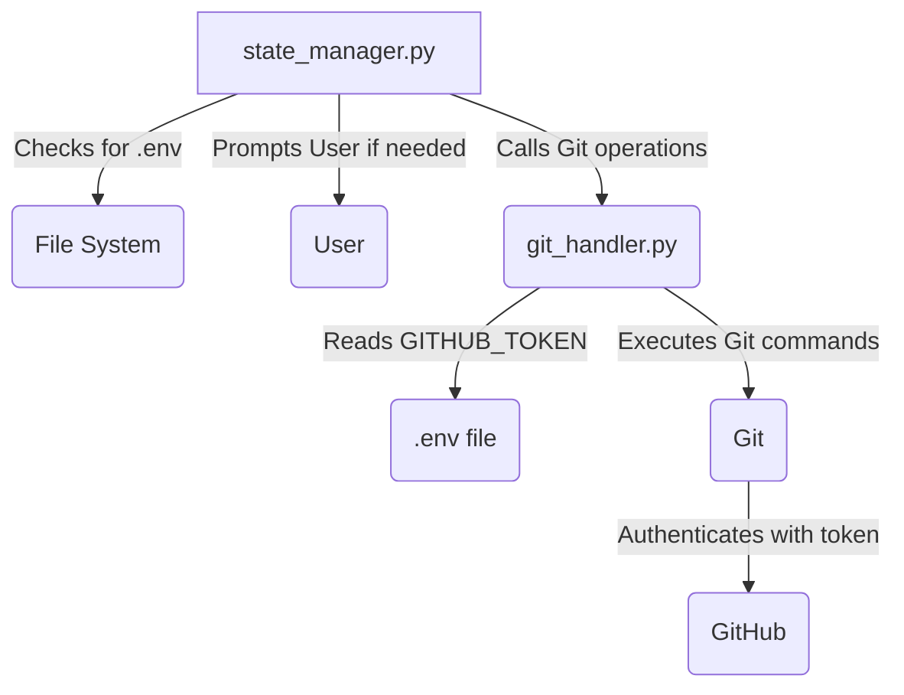

# dw6_test_bed_v4 - Cycle 1 - Technical Specification

**Date:** 2025-06-25

## 1. Overview

This cycle focuses on eliminating manual GitHub authentication prompts by integrating a token-based, programmatic approach. This will make the workflow fully automatable, remove friction from the development process, and improve the overall developer experience.

## 2. Scope

### In Scope

*   Integrate `python-dotenv` to securely manage a `GITHUB_TOKEN`.
*   Update `git_handler.py` to automatically detect the remote repository URL from the local Git configuration.
*   Modify all push and fetch operations to use the `GITHUB_TOKEN` for authentication.
*   Add logic to the workflow to check for a `.env` file and guide the user in creating one if it's missing.

### Out of Scope

*   Creating a full-fledged GitHub API wrapper.
*   Managing multiple GitHub accounts or tokens within the same project.

## 3. System Architecture

The `git_handler.py` module will be the central component for all Git operations. It will use the `python-dotenv` library to load the `GITHUB_TOKEN` from a `.env` file in the project root. The `state_manager.py` will orchestrate the checks and provide user guidance when necessary.

## 4. Data Model

No changes to the persistent data model. A new, non-versioned `.env` file will be introduced to store the `GITHUB_TOKEN`.

## 5. Functional Requirements (User Stories)

*   **US-01:** As a developer, I want the workflow to automatically use my GitHub token for authentication so that I don't have to enter my credentials manually.
    *   **Acceptance Criteria 1:** The system successfully pushes to and fetches from the remote repository without any UI prompts for credentials.
    *   **Acceptance Criteria 2:** The system reads the `GITHUB_TOKEN` from a `.env` file located in the project root.
*   **US-02:** As a new user, I want the system to guide me in setting up my `GITHUB_TOKEN` so that I can get started quickly and without errors.
    *   **Acceptance Criteria 1:** If the `.env` file or `GITHUB_TOKEN` is missing, the system fails gracefully with a clear error message.
    *   **Acceptance Criteria 2:** The error message explicitly instructs the user on how to create the `.env` file and what content to add (e.g., `GITHUB_TOKEN=your_token_here`).

## 6. Implementation Plan

1.  **Task:** Update `git_handler.py` to include a function that checks for the existence of `.env` and loads the `GITHUB_TOKEN`. This function should be called at the beginning of any remote operation.
2.  **Task:** Modify the `push_to_remote` and `fetch` functions in `git_handler.py` to construct an authenticated remote URL using the loaded token (e.g., `https://<token>@github.com/user/repo.git`).
3.  **Task:** In `state_manager.py`, update the `_validate_stage` method for the `Deployer` stage to call a new validation function in `git_handler.py` that ensures the `GITHUB_TOKEN` is available before attempting any remote interaction.
4.  **Task:** If the token is missing, the validation should fail with a clear, user-friendly error message that explains how to create the `.env` file and add the `GITHUB_TOKEN`.
5.  **Task:** Create a new test file, `tests/test_git_handler.py`, to test the new token-based authentication logic. Use mocks to simulate the presence and absence of the `.env` file and token.

## 7. Questions & Assumptions

*   **Assumption:** The user has a GitHub Personal Access Token (PAT) with the necessary permissions (`repo` scope).
*   **Question:** Should the system offer to create the `.env` file automatically, or just provide instructions? For this cycle, we will stick to providing clear instructions to the user.

