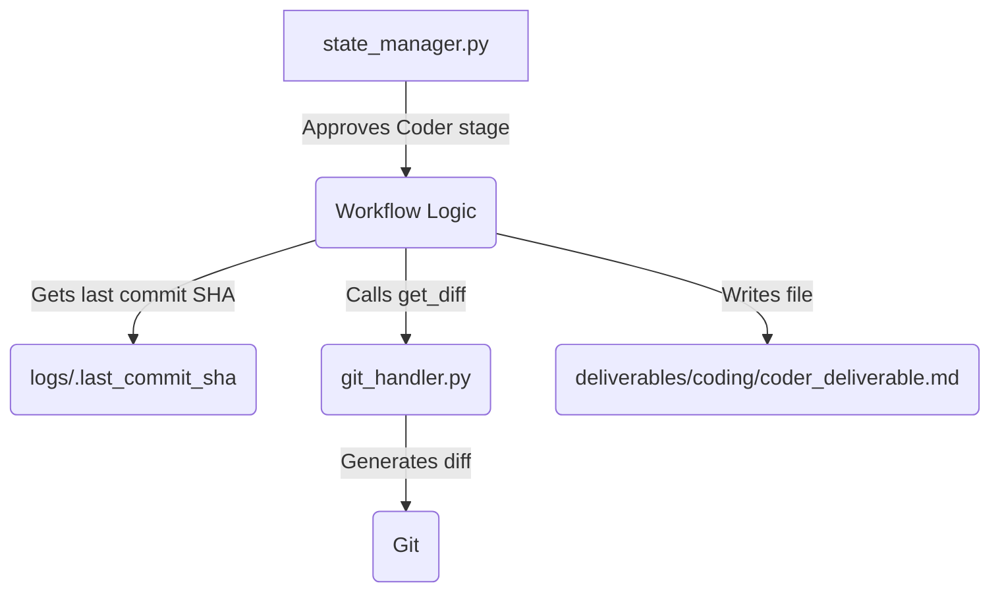

# Technical Specification: Automated Coder Deliverable Generation

**Cycle:** 2
**Requirement ID:** 3
**Date:** 2025-06-25

## 1. Overview

This cycle aims to automate the creation of the `coder_deliverable.md` file. This will reduce manual work, ensure consistency, and provide a clear, auditable record of all code changes made during the `Coder` stage.

## 2. Scope

### In Scope

*   Create a new function in `git_handler.py` to generate a git diff between the commit saved at the start of the `Coder` stage and the current `HEAD`.
*   Update `state_manager.py` to automatically generate `deliverables/coding/coder_deliverable.md` when the `Coder` stage is approved.
*   The deliverable will include a list of modified files and the full git diff.

### Out of Scope

*   Advanced diff analysis or summarization.
*   Support for non-Git version control systems.

## 3. System Architecture

The `state_manager.py` will orchestrate this process. When the `Coder` stage is approved, it will call new functions in `git_handler.py` to get the necessary information from Git and then write the deliverable file.

## 4. Data Model

No changes to the data model. The process will use the existing `.last_commit_sha` file to determine the starting point for the diff.

## 5. Functional Requirements (User Stories)

*   **US-01:** As a developer, I want the system to automatically generate a coder deliverable so that I don't have to create it manually.
    *   **Acceptance Criteria 1:** When the `Coder` stage is approved, a `coder_deliverable.md` file is created in the `deliverables/coding` directory.
    *   **Acceptance Criteria 2:** The file contains a list of all files modified during the `Coder` stage.
    *   **Acceptance Criteria 3:** The file contains the full git diff of all changes.

## 6. Implementation Plan

1.  **Task:** In `git_handler.py`, create a new function `get_diff_from_last_commit()` that reads the SHA from `logs/.last_commit_sha` and returns the git diff from that commit to `HEAD`.
2.  **Task:** In `state_manager.py`, update the `approve()` method. When the `Coder` stage is being approved, it should call `get_diff_from_last_commit()`.
3.  **Task:** Create a new function in `state_manager.py` to format the diff and file list into a markdown string and write it to `deliverables/coding/coder_deliverable.md`.
4.  **Task:** Add a new test in `tests/test_state_manager.py` to verify that the deliverable is created correctly. Use mocks to simulate the git diff and file system operations.

## 7. Questions & Assumptions

*   **Assumption:** The `logs/.last_commit_sha` file will always be present when the `Coder` stage is approved.
*   **Question:** Should the deliverable be committed automatically? For this cycle, we will focus on just creating the file. The user can then review and commit it as part of the `Deployer` stage.
