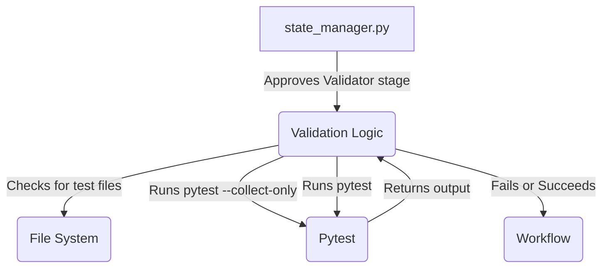

# Technical Specification: Enforce Test Presence in Validator Stage

**Cycle:** 3
**Requirement ID:** 4
**Date:** 2025-06-25

## 1. Overview

This cycle addresses a critical flaw in the DW6 protocol: the `Validator` stage can be approved without any tests being present or executed. This change will enforce the presence and execution of a valid test suite, ensuring that all code changes are verified before moving forward.

## 2. Scope

### In Scope

*   Modify the `_validate_stage` method in `state_manager.py` for the `Validator` stage.
*   Add a check to ensure the `tests` directory exists and contains at least one test file (matching `test_*.py`).
*   Integrate a `pytest --collect-only` command to verify that tests are being collected.
*   Parse the output of `pytest` to ensure at least one test was run.

### Out of Scope

*   Complex analysis of test coverage or quality.
*   Support for testing frameworks other than `pytest`.

## 3. System Architecture

The validation logic will be contained entirely within the `_validate_stage` method in `state_manager.py`. It will interact with the file system to check for test files and run `pytest` as a subprocess to collect and execute tests.

## 4. Data Model

No changes to the data model are required for this cycle.

## 5. Functional Requirements (User Stories)

*   **US-01:** As a developer, I want the workflow to prevent me from approving the `Validator` stage if I have not written any tests, so that I don't accidentally merge unverified code.
    *   **Acceptance Criteria 1:** The `Validator` stage approval fails if the `tests` directory does not exist or is empty.
    *   **Acceptance Criteria 2:** The approval fails if `pytest` runs but collects zero tests.
    *   **Acceptance Criteria 3:** The error message clearly explains why the validation failed (e.g., "No tests found.").

## 6. Implementation Plan

1.  **Task:** In `state_manager.py`, update the `_validate_stage` method for the `Validator` stage.
2.  **Task:** Before running `pytest`, add a check using `os.path.exists` and `os.listdir` to verify that the `tests` directory exists and contains files matching the `test_*.py` pattern.
3.  **Task:** If the check fails, exit the process with a clear error message.
4.  **Task:** Modify the existing `subprocess.run` call for `pytest`. First, run with the `--collect-only` flag.
5.  **Task:** Use regular expressions to parse the output of the collection step and extract the number of collected tests.
6.  **Task:** If the number of collected tests is zero, exit with an error.
7.  **Task:** If tests are collected, proceed with the full `pytest` run as before.
8.  **Task:** Add a new test to `tests/test_state_manager.py` to verify the new validation logic. Mock the file system and the `subprocess.run` calls to simulate different scenarios (no tests, tests found, etc.).

## 7. Questions & Assumptions

*   **Assumption:** The project will continue to use `pytest` as its sole testing framework.
*   **Assumption:** All test files will follow the `test_*.py` naming convention.
